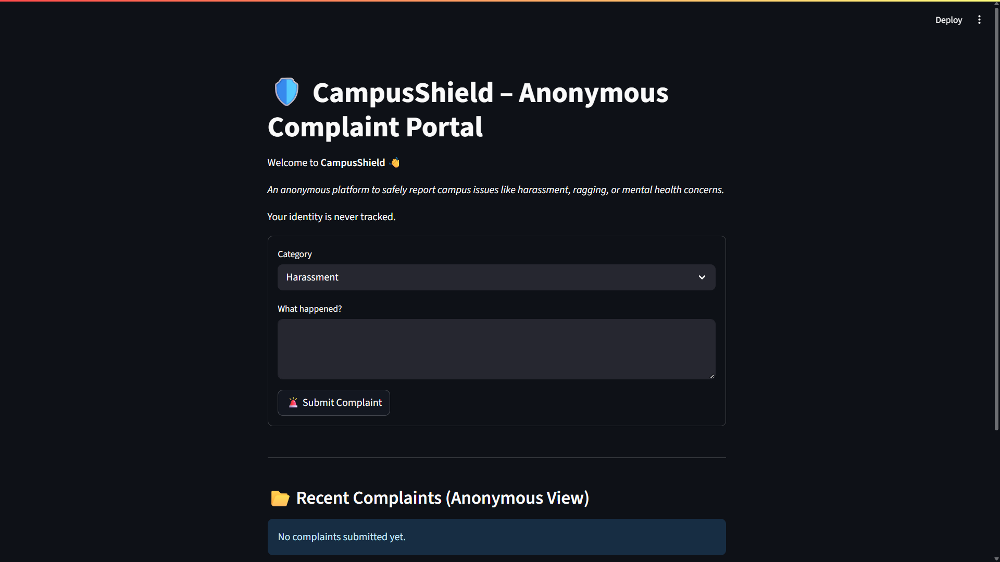

# 🛡️ CampusShield – Anonymous Reporting Tool

### 👨‍🎓 Built for VibeCode Hackathon 2025

## 🚩 Problem
Students often hesitate to report issues like harassment, ragging, or discrimination on campus due to fear, peer pressure, or lack of support.

## 💡 Solution
**CampusShield** provides a safe and anonymous way for students to submit complaints. It ensures:
- No login required
- Identity is never tracked
- Submissions are categorized and timestamped
- Admins can view and download reports

## 🔧 Tech Stack
- 🐍 Python
- 🌐 Streamlit
- 📁 JSON for local storage

## ✨ Features
- Anonymous complaint submission
- Categorized issues: Harassment, Ragging, Mental Health, etc.
- Timestamped complaints with unique ID
- Recent complaint viewer (anonymized)
- Auto-creates storage file if missing

## 🖼️ Demo

## 🚀 How to Run

1. Clone this repo:
```bash
git clone https://github.com/your-username/campusshield.git
cd campusshield
```
## 📌 Future Improvements
- Email alert system for urgent reports
- Admin dashboard with filters
- Google Sheets integration
- Deploy on Streamlit Cloud

## 📄 License
MIT License – feel free to use and build upon this project.
